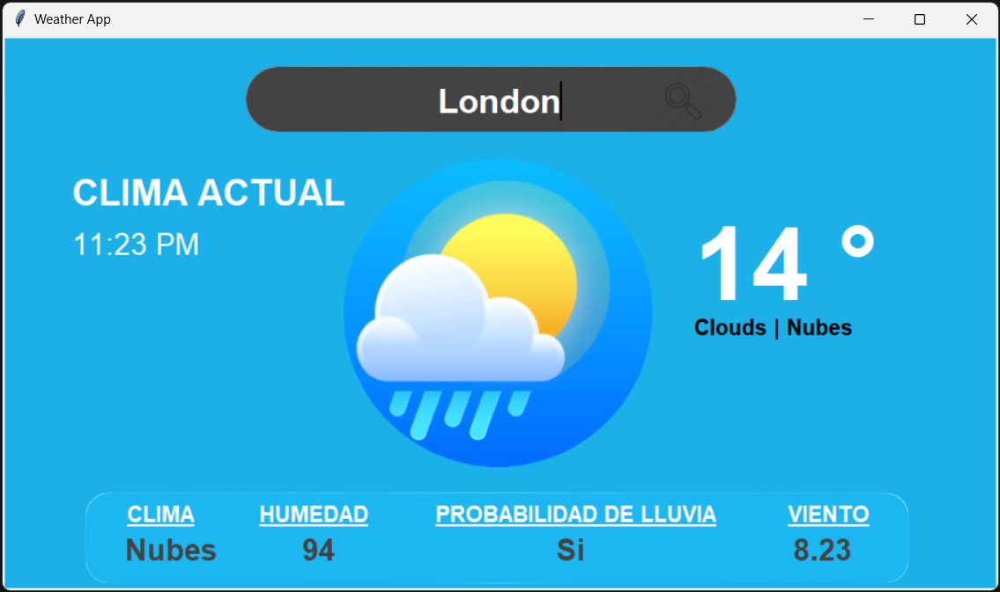

# Weather App

This is a project of a weather forecast application built in Python using the Tkinter library for the graphical user interface. The application allows users to check the current weather for a specific city and provides detailed information about temperature, weather condition, humidity, rain probability, and wind speed.

## Requirements

Before running the application, make sure you have the following Python libraries installed:

- `tkinter`: The Python standard library for creating graphical user interfaces.
- `os`: Used to manage file and directory paths.
- `datetime`: For working with dates and times.
- `pytz`: For handling time zones.
- `requests`: For making HTTP requests to a weather forecast API.
- `PIL`: The Python Imaging Library for working with images.
- `geopy`: Used to geocode the location entered by the user.
- `timezonefinder`: For determining the time zone of the location.
- `googletrans`: For translating weather conditions from English to Spanish.

## Usage

1. Run the Python file `weather_app.py`.
2. The application window will open, and you'll see a search field at the top.
3. Enter the name of the city for which you want to get the weather forecast and press the search button.
4. The application will display updated information about the weather in that city, including temperature, weather condition, humidity, rain probability, and wind speed.

## Features

- **City Search**: Allows users to enter the name of the city they're interested in.
- **Local Timezone**: Displays the local time of the selected city.
- **Weather Details**: Provides details such as temperature, humidity, rain probability, and wind speed.
- **Translation**: Automatically translates the weather condition from English to Spanish.
- **Graphical User Interface**: Offers an easy-to-use graphical interface.

## Screenshots

## Notes

- Ensure you have an active internet connection for the application to fetch weather forecast data.
- The application is designed to work with an OpenWeatherMap API key. Make sure to obtain your own API key and replace it in the `my_key` variable within the code.
- The accuracy of weather data depends on the availability and quality of data provided by the OpenWeatherMap API.
